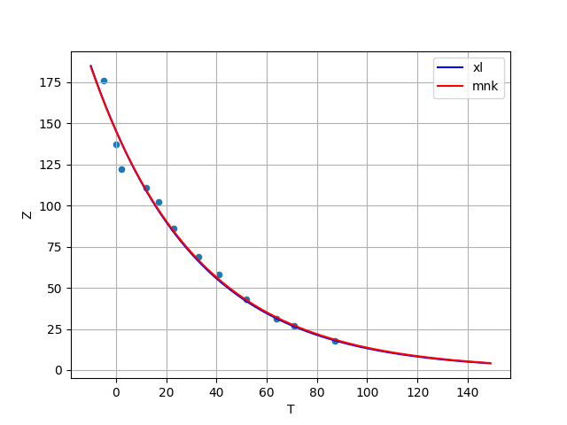
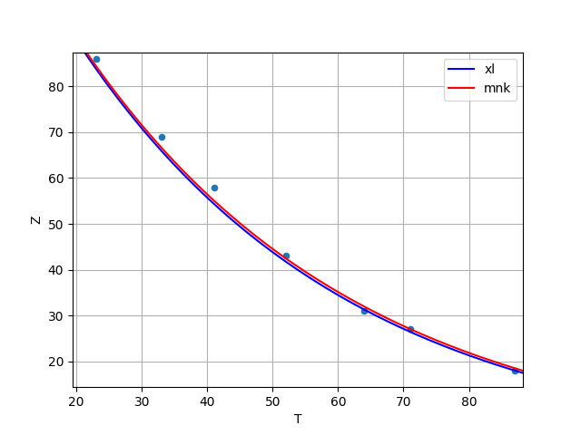

Данные хранятся в файле `temp.csv` далее на графиках,`Z` - сопротивление и `T` - температура

Решение `main.cpp`: **-0.0236806
4.98004**

Решение можно проверить построив график с помощью _matpltlib_:

Графики показывают зависимость показаний датчика от температуры.
 `xl` - апроксимация экспонентой в xl, `mnk` - график на основе мнк.
